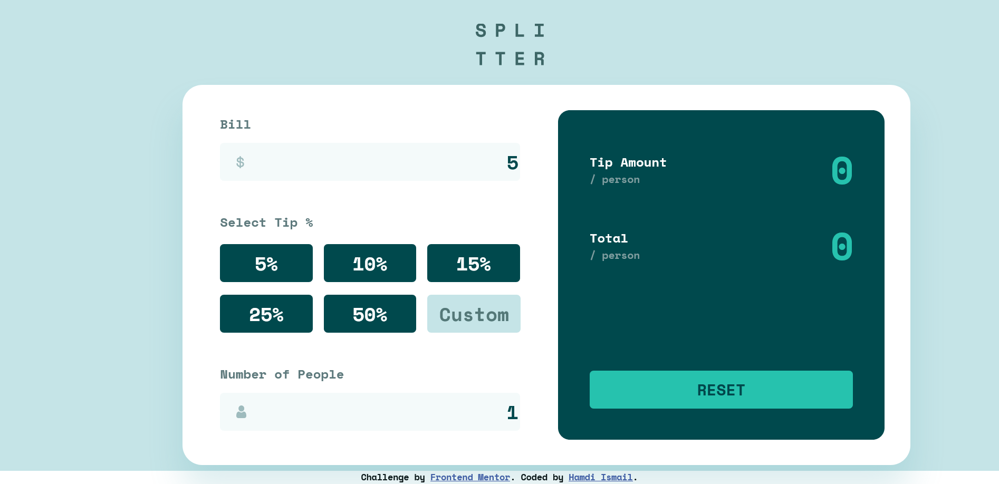

# Tip calculator app

## Table of contents

- [Overview](#overview)
  - [The challenge](#the-challenge)
  - [Screenshot](#screenshot)
  - [Links](#links)
- [My process](#my-process)
  - [Built with](#built-with)
  - [What I learned](#what-i-learned)
  - [Continued development](#continued-development)
- [Author](#author)

## Overview

This is a tip calculator app. simply enter the total bill amount, number of people splitting the bill, then select the tip percentage or select custom to enter your own percentage. This app will display the tip amount per person and the total amount due per person including tip.

### Screenshot

### Links

- Solution URL: (https://github.com/hamdihismail/tip-calculator-app)
- Live Site URL: (https://precious-bonbon-5a0e79.netlify.app/)

## My process

Started with HTML markup, then did all the styling and mobile break points, finally the JavaScript logic.

### Built with

- Semantic HTML5 markup
- CSS custom properties
- Flexbox
- CSS Grid
- Responsive design
- JavaScript

### What I learned

Great practice for Javascript and DOM manipulation.

### Continued development

Continue to get better with JavaScript by doing increasingly more difficult challenges.

## Author

- Website - (https://www.hamdihismail.com)
